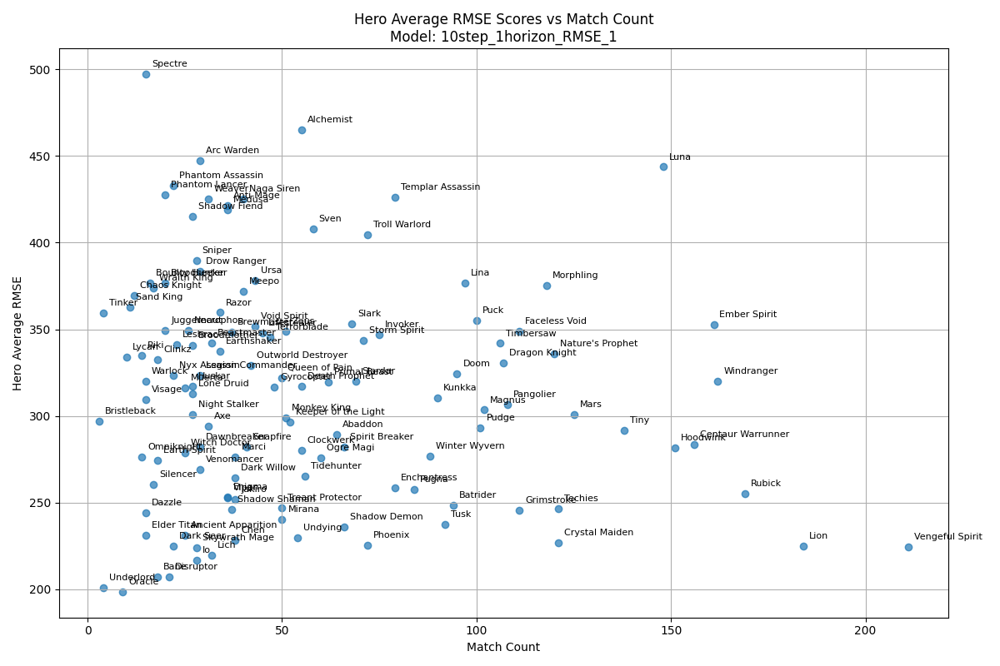

# DATA698 Capstone - Utilizing an LSTM + Random Forest/XGBoost Classifiers to Predict Wins in eSports

This repository contains the Colab Notebooks stored at: https://drive.google.com/drive/folders/19J7RBgglXAG8rFA1xg8ar4_D-M59zfCM?usp=drive_link

This code is meant to be used in the Colab Environment. If downloading from this github, enter the "Code" folder to see a nested folder also called "698." Download that 698 folder and upload it to Google Drive, allow Colab to access your Drive and the code/navigational paths should function. 
This project is my first time using PyTorch to generate forecasted values using the LSTM model (a recurrent neural network / RNN) and using these forecasted values as features in a classifier to determine the winner of a Dota 2 match.

## Contextual Summary on Purpose and Data

Dota 2 holds 8 out of the top 10 spots in the highest prizepools of all time in eSports, all hovering between $20 - 40 million. In comparison, the highest purse in the PGA tour of 2024 is the Player's Championship at $25 million.
Betting and spectating are a majority of revenue behind the eSports industry (valued at $5.4bn in 2024) with in-game, and spectator features predicting likelihood as a value-add and informative metric for betting and spectating alike.

Valve's in-game feature tends to be around 70-75% accurate, while this model hovers between 80-90% depending on in-game time.

This project evaluates the effects of:
- using embedded hero features learned from the LSTM as features in the classifier
- using positional gold values of heroes rather than team averages
- using different embed sizes on forecasting horizons
- evaluating if embeddings are useful at all in forecasting or classifying

## Breakdown of Code

* Due to some computing limitations at the time, the data was broken into different sets of data to train different random forest/xgboost models. The data and models were segmented to train and predict on game metrics at every 5 minutes between minute 15 and minute 45 of a game.
* In the code, you will see datasets like "rf_df_25" which represents match data for games that lasted for 25 minutes. (Some games don't). If computation was not an issue, a separate "minute" feature could be used and fed in with the other data, rather than training models on only info at specific minutes.
  
There are two main paths of notebooks in the drive and are listed in sequential order below:

  ### Embedded LSTM Path
#### 1. data_prep_10step_5horizon.ipynb - preps data
  - removes missing/mislabeled data
  - re-shapes into an acceptable format for the LSTM & Visualizations & Classifier Models for intake
  - saves the curated dataframes in "10step_5horizon/data" so that downstream notebooks can load them from CSV, rather than calling this everytime

#### 2. LSTM_Model_Classes_dynamic.ipynb - defines the TimeSeriesDataset, LSTM, and Embedding Layer classes to be called by Train_Multistep.ipynb
     
#### 3. Train_MultiStep.ipynb - trains the model until lack of improvement in Test RMSE for some number of epochs defined by user
  - calls LSTM_Model_Classes_dynamic.ipnyb to instatiate the classes defined there
  - each model trained is saved in the "models/lstm" directory
  - each model parameters for training must be defined by user (lookback = n, horizon = n, embed_size = n)
  - prints out train and test rmse at each epoch, as well as the final best model and saves it as a csv in the "models/lstm" directory

       
#### 4. Visualize_Horizon5_csvload_automated.ipynb - Creates some visualizations to see how well the model is performing
  - calls LSTM_Model_Classes_dynamic, loads datasets curated by data_prep_10step_5horizon.ipynb
  - `instantiate_model(df,hero_df,lookback,horizon,embed_dim)` - instatiates and loads selected model to perform metric testing on
  - `run_over_heroes(testing_df,hero_df,model, model_dict)` - to determine how well the LSTM generlizes to each hero, creates average RMSE's for each and stores in a df
  - `select_matches_for_single_ts_plot(df_results_all_nots)` - chooses the best and worst matches, in regards to RMSE, of the best and worst hero generalizations to pass match indexes to plot_single_ts()
  -`plot_single_ts(testing_df,record, lookback, horizon, file_name)` - generates a time-series plot of forecasted values against actual values for comparison
    
  
  
  - `plot_scatter(df_hero_avg_rmse, lookback,horizon, embed_dim,file_name)` - plots a scatter of average hero RMSE scores from LSTM against count of matches to check for bad generalization/lack of data
    
  
               
  - `plot_hist(df_hero_avg_rmse,file_name)` - takes in the df created by run_over_heroes and creates a histogram to see a general performance evaluation
       
  
     
#### 5. RF Training_embed_automated.ipynb - Trains the random forest and XGBoost models on the datasets
   - loads the models from "models/lstm" to access the embeddings to load and use as features to train on
   - get_hero_embedding_and_concat_features(df) - replaces the hero_id features in the standard training data and replaces with the appropriate embedding vector
   - `create_save_plots(rf_classifier_name, X_test_name, y_test_name, df,file_name)` - Creates example trees with feature importances
           
  
  
       
#### 6. Predicting on RF Structures.ipynb - Using the models trained from step e., predicts on the test data and generates accruacy metrics
   - calls LSTM_Model_Classes_dynamic.ipynb, Useful_Functions.ipnyb
   - `predict_on_df_rf(df, lookback, horizon)` - pulls the timeseries out of the test data slices the series based on lookback value and predicts the forecasted gold value
   - loads models, calculates metrics, and saves them in "698\10step_5horizon\models\results"
           
  

### Non-Embedded LSTM Path
Since this is simply a replica of the above workflow, less details will be provided. Only major difference is that the LSTM model and subsequent models do not in-take an embedding vector
a. data_prep_10step_5horizon.ipynb - preps data
b. LSTM_Model_Classes_no_embed.ipynb     
c. Train_MultiStep_no_embed.ipynb     
d. Visualize_Horizon5_no_embed.ipynb     
e. RF Training_no_embed_automated.ipynb     
f. Predicting on RF Structures.ipynb (note that this is the same as the prior workflow, not a typo)
     
Since adding an embedding layer changes the dimensions of the tensors, and other more complicated features, passed down from model training to visualizations, the quickest way to accomodate the difference was to create separate notebooks to accept the changes.

Ideally, this would be resolved with more dynamic code, but due to time restrictions, this seemed the easier method. The code can already accept differing lookback and horizon values across all notebooks within a path.

